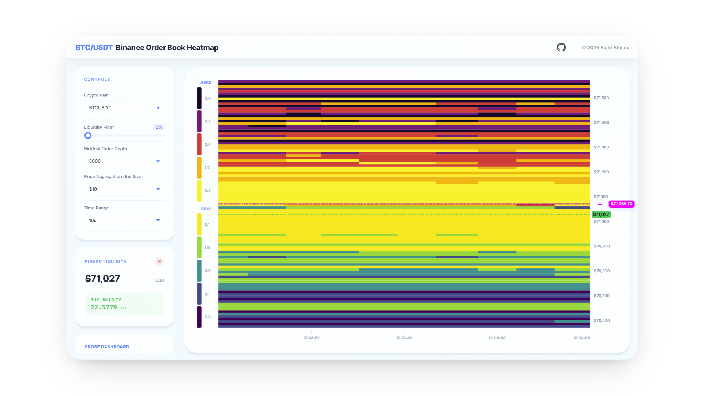
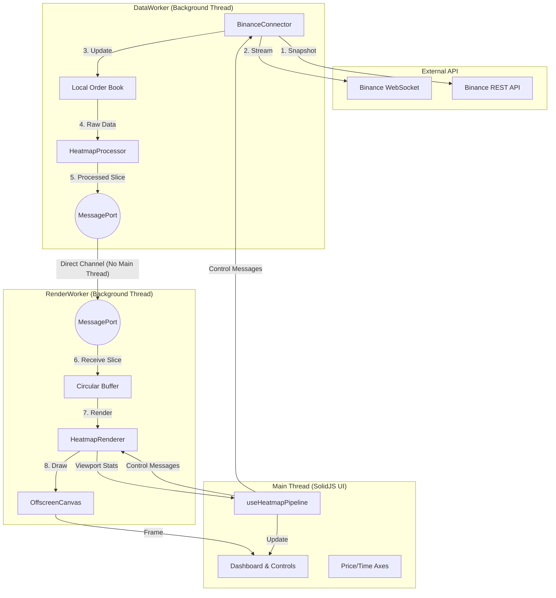

# Heatmap: Real-Time Order Book Visualisation

[](https://www.typescriptlang.org/)
[](https://www.solidjs.com/)
[](https://vitejs.dev/)

A high-performance, multi-threaded financial data visualisation tool for rendering real-time order book heatmaps. This project implements a local order book engine synced with the Binance BTC/USDT spot market, providing traders with deep insights into market liquidity and volume clusters.

## ⏯️ [Click to View Website](https://sajidahmed.co.uk/crypto-order-book-heatmap/)

## Table of Contents

- [Key Features](#key-features)
- [Architecture](#architecture)
- [Tech Stack](#tech-stack)
- [Key Technical Decisions](#key-technical-decisions)
- [Challenges & Lessons](#challenges--lessons)
- [Installation & Usage](#installation--usage)
- [License](#license)

---

## Key Features

- **Multi-Threaded Pipeline:** Utilises Web Workers to decouple data ingestion (`DataWorker`) from rendering (`RenderWorker`), ensuring the main UI thread remains responsive even during high-volatility market events.
- **High-Performance Binning:** Employs a zero-allocation `HeatmapProcessor` that uses pre-allocated `TypedArrays` to process thousands of order book levels into normalised heatmap slices in sub-10ms intervals.
- **Rank-Based Normalisation:** Implements a rank-transform algorithm to map power-law distributed order book volumes into a 5-step discrete intensity scale (Weather Radar style) for maximum visual clarity.
- **Sub-Pixel Smooth Rendering:** Features a custom "shift-and-draw" rendering engine on an `OffscreenCanvas` with float-based coverage blending for sub-pixel accuracy.
- **Full Order Book Integrity:** Maintains a local order book with 5000 levels per side, featuring snapshot reconciliation and sequence gap detection to ensure 100% data accuracy relative to the exchange.
- **Adaptive UI:** Includes interactive controls for zoom, pan, auto-centring, and volume filtering, alongside dynamic price and time axes.



---

## Architecture

The system follows a reactive, decoupled architecture where the main thread orchestrates a direct `MessageChannel` between the data and render workers.

### Directory Structure

```text
src/
├── components/          # Layout-level SolidJS components
├── core/                # Application services (HeatmapService) and context
├── engine/              # Core business logic (Binning, Normalisation, Book Core)
│   ├── bookCore.ts      # Order book data structures
│   ├── processor.ts     # Heatmap binning & rank normalisation logic
│   └── palettes.ts      # Colour mappings (Magma, Viridis)
├── ui/                  # UI components (Axes, Legend, Controls) and Hooks
│   └── useHeatmapPipeline.ts # Orchestrates worker communication
├── workers/             # Multi-threading logic
│   ├── data.worker.ts   # Binance API connector & processing
│   └── render.worker.ts # OffscreenCanvas rendering engine
└── index.tsx            # Application entry point
```

### System Flow



---

## Tech Stack

| Category | Tools |
| :--- | :--- |
| **Framework** | SolidJS |
| **Language** | TypeScript |
| **Build Tool** | Vite |
| **Rendering** | OffscreenCanvas (2D Context) |
| **Concurrency** | Web Workers, MessageChannel |
| **Data Source** | Binance API (WebSocket & REST) |

---

## Key Technical Decisions

| Decision | Logic & Reasoning |
| :--- | :--- |
| **Web Workers** | Decoupling ingestion and rendering prevents UI "jank" and ensures the application can handle the high message throughput of the crypto markets without blocking the event loop. |
| **OffscreenCanvas** | Offloading the canvas rendering to a background thread allows the `RenderWorker` to maintain a consistent 60 FPS regardless of main-thread load. |
| **TypedArrays** | Using `Float64Array` and `Int32Array` in the hot path minimizes heap allocations, reducing the overhead of Garbage Collection (GC) which is critical for low-latency financial apps. |
| **Rank Normalisation** | Order book volumes often follow a power-law distribution. Linear scaling results in either oversaturated or invisible data. Rank-based scaling ensures consistent visual contrast. |
| **Discrete Quantisation** | Mapping intensities to 5 discrete levels (Weather Radar style) simplifies visual scanning for traders, making it easier to identify significant support/resistance levels. |

---

## Challenges & Lessons

### Local Order Book Synchronisation
Maintaining a perfectly synced local copy of the order book requires handling the sequence of a REST snapshot followed by real-time WebSocket updates. Implementing the Binance-specific reconciliation logic (tracking `U` and `u` update IDs) was a critical challenge that reinforced the importance of sequence validation and error-handling in high-frequency data streams.

### Memory Management in Workers
Transferring large amounts of data between workers can be expensive. By using a direct `MessageChannel` between the `DataWorker` and `RenderWorker`, the main thread is bypassed entirely for the high-frequency "Render Slice" messages, significantly reducing context-switching overhead.

---

## Installation & Usage

### Prerequisites

- [Node.js](https://nodejs.org/) (v18 or higher)
- [npm](https://www.npmjs.com/) or [pnpm](https://pnpm.io/)

### Setup

1. Clone the repository:
   ```bash
   git clone https://github.com/sahmed0/crypto-order-book-heatmap.git
   cd heatmap
   ```

2. Install dependencies:
   ```bash
   npm install
   ```

3. Start the development server:
   ```bash
   npm run dev
   ```

4. Build for production:
   ```bash
   npm run build
   ```

---

## License


Copyright (c) 2026 Sajid Ahmed. **All Rights Reserved.**

This repository is a **Proprietary Project**.

While I am a strong supporter of Open Source Software, this specific codebase represents a significant personal investment of time and effort and is therefore provided with the following restrictions:

* **Permitted:** Viewing, forking (within GitHub only), and local execution for evaluation and personal, non-commercial usage only.
* **Prohibited:** Modification, redistribution, commercial use, and AI/LLM training.

For the full legal terms, please see the [LICENSE](./LICENSE) file.
